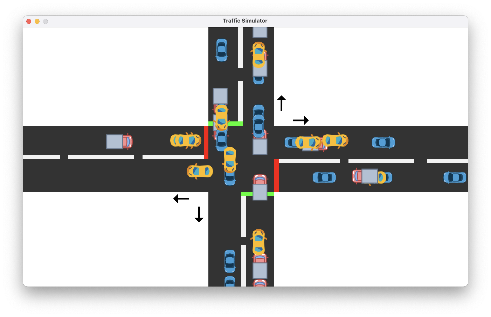

# Traffic Simulator

A desktop traffic simulation application built with Java Swing and Maven, providing an interactive environment to simulate and visualize traffic flow patterns with multiple vehicle types including cars and trucks. Features a comprehensive GUI with form-based controls and real-time vehicle tracking.

## Features

- **Multi-Vehicle Support**: Simulation of cars and trucks with distinct visual representations
- **Interactive GUI**: Java Swing interface with form-based controls (Simulator.form)
- **Real-time Visualization**: Dynamic vehicle movement with custom PNG graphics
- **Traffic Management**: Advanced traffic control system with TrafficController
- **Service Architecture**: JMS-based service layer for simulation management
- **Utility Classes**: Comprehensive utilities for image handling and vehicle operations
- **Cross-platform**: Runs on Windows, macOS, and Linux

## Screenshots


*Main simulation interface showing traffic flow*

## Prerequisites

- **Java**: JDK 8 or higher
- **Maven**: Version 3.6.0 or higher
- **Operating System**: Windows, macOS, or Linux

## Installation

### Clone the Repository
```bash
git clone https://github.com/uchithvihanga/traffic-simulator.git
cd traffic-simulator
```

### Build the Project
```bash
mvn clean compile
```

### Run the Application
```bash
mvn exec:java -Dexec.mainClass="com.uchith.trafficsimulator.main.Simulator"
```

### Create Executable JAR
```bash
mvn clean package
java -jar target/traffic-simulator-1.0-SNAPSHOT.jar
```

## Project Structure

```
traffic-simulator/
├── src/
│   ├── main/
│   │   ├── java/
│   │   │   └── com/uchith/trafficsimulator/
│   │   │       ├── component/
│   │   │       │   └── Vehicle.java
│   │   │       ├── main/
│   │   │       │   ├── Simulator.java
│   │   │       │   └── Simulator.form
│   │   │       ├── service/
│   │   │       │   └── JMSService.java
│   │   │       └── util/
│   │   │           ├── enums/
│   │   │           ├── ImageUtil.java
│   │   │           ├── TrafficController.java
│   │   │           └── VehicleUtil.java
│   │   └── resources/
│   │       ├── car_blue.png
│   │       ├── car_yellow.png
│   │       └── truck.png
│   └── test/
│       └── java/
├── target/
├── pom.xml
├── README.md
└── LICENSE
```

## Usage

### Starting the Simulation
1. Launch the application using one of the installation methods above
2. The main window will display the traffic simulation canvas
3. Use the control panel to adjust simulation parameters

## Architecture Overview

### Core Components

- **`Simulator.java`**: Main application class with GUI implementation (Simulator.form)
- **`Vehicle.java`**: Vehicle entity class representing cars and trucks
- **`TrafficController.java`**: Manages traffic flow logic and vehicle interactions
- **`JMSService.java`**: Handles messaging service for simulation events
- **`VehicleUtil.java`**: Utility methods for vehicle operations and calculations
- **`ImageUtil.java`**: Image loading and rendering utilities for vehicle graphics

### Vehicle Types
The simulator supports multiple vehicle types with distinct visual representations:
- **Blue Cars** (`car_blue.png`)
- **Yellow Cars** (`car_yellow.png`) 
- **Trucks** (`truck.png`)

### Controls
- **Start/Pause**: Begin or pause the traffic simulation
- **Reset**: Reset the simulation to initial state
- **Vehicle Controls**: Add different types of vehicles (cars/trucks) to the simulation
- **Traffic Management**: Control traffic flow using the TrafficController
- **Real-time Monitoring**: View simulation statistics and vehicle behavior

### Configuration
The application uses resource files and utility classes for configuration:
- Vehicle images are loaded from the `resources/` directory
- Traffic parameters can be adjusted through the GUI form
- Enum-based configuration for vehicle types and states

## Development

### Dependencies
The project uses the following key dependencies (defined in `pom.xml`):
- **Java Swing** (built-in) - GUI framework
- **JMS (Java Message Service)** - For simulation event handling
- **JUnit 5** (for testing)
- **Maven Compiler Plugin** - Java compilation
- **Maven Exec Plugin** - Application execution

### Building from Source
```bash
# Compile the project
mvn compile

# Run tests
mvn test

# Package into JAR
mvn package

# Clean build artifacts
mvn clean
```

### Adding New Features
1. Fork the repository
2. Create a feature branch: `git checkout -b feature/new-feature`
3. Make your changes and commit: `git commit -am 'Add new feature'`
4. Push to the branch: `git push origin feature/new-feature`
5. Submit a pull request

## System Requirements

- **Memory**: Minimum 512MB RAM, recommended 1GB+
- **CPU**: Dual-core processor or better
- **Display**: 1024x768 resolution minimum
- **Java Version**: JDK 8+

## Troubleshooting

### Common Issues

**Application won't start**
- Ensure Java is properly installed: `java -version`
- Check that JAVA_HOME environment variable is set
- Verify Maven is installed: `mvn -version`

**Poor performance**
- Reduce vehicle density in simulation settings
- Lower the frame rate in configuration
- Close other resource-intensive applications

**Build failures**
```bash
# Clear Maven cache and rebuild
mvn clean install -U
```

### Code Style
- Follow Java naming conventions
- Use meaningful variable and method names
- Add comments for complex algorithms
- Write unit tests for new features

## Acknowledgments

- Java Swing documentation and community
- Traffic simulation algorithms and research papers
- Open source contributors and testers

## Roadmap

- [ ] Add more vehicle types (motorcycles, buses, emergency vehicles)
- [ ] Implement traffic light synchronization
- [ ] Add road network editor
- [ ] Export simulation statistics and reports
- [ ] Multi-lane highway simulation
- [ ] Weather and environmental effects
- [ ] Save/load simulation scenarios

## Class Documentation

### Core Classes
- **`Simulator`**: Main application window with form-based GUI
- **`Vehicle`**: Represents individual vehicles in the simulation
- **`TrafficController`**: Manages traffic flow and vehicle interactions
- **`JMSService`**: Handles asynchronous simulation events
- **`VehicleUtil`**: Helper methods for vehicle operations
- **`ImageUtil`**: Manages vehicle image resources and rendering

---

⭐ **Star this repository if you found it helpful!**
